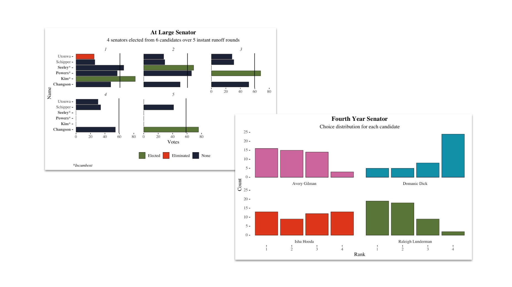

# Replication materials for ASA Spring 2024 RCV Elections

In March 2024, the Augustana Student Association conducted its spring elections using Viking Central (Campus Labs/Anthology). For the second year, ballots were cast and tabulated using Ranked Choice Vote. This repository contains all materials necessary to replicate the final results, including the raw results and computations in R using the `vote` package.

## What this repository does

-   Ingests raw vote data (`./data/SP_24_ElectionResults.csv`) from Campus Labs and cleans column names

-   Prepares vote data for each race by pivoting the returns such that

    -   Each row is a vote

    -   Each column is a candidate

    -   Each value is a rank

-   Calculates RCV results using `vote::irv()`

-   Plots results using `ggplot()`

-   Exports plots and results to `./out/`

-   Creates a report showing results for each race and turnout results
